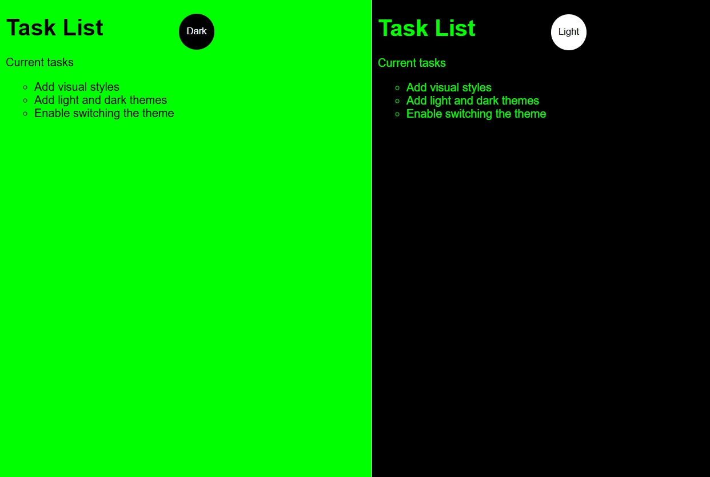

# 🌐 Site Simples EV Bradesco

Projeto de uma página simples feito para aprender um pouco sobre a funcionalidade da linguagem **JavaScript**.  
O objetivo foi treinar a construção de páginas estáticas utilizando **HTML, CSS e JavaScript**, aplicando conceitos de layout, estilização e responsividade.

---

## 🖼️ Demonstração

👉 [Acesse o projeto online](https://brrn91.github.io/site-simples-ev-bradesco/)

---

## 🛠️ Tecnologias Utilizadas
- **HTML5**
- **CSS3**
- **JavaScript**
- Estruturação semântica e boas práticas de organização

---

## ⚙️ Funcionalidades
- ✅ Estrutura de página institucional
- ✅ Elementos estilizados com CSS  
- ✅ Layout simples e responsivo  
- 🚀 Hospedado facilmente no GitHub Pages  

---

💡 **Nota:** Este projeto faz parte do meu aprendizado e portfólio. Feedbacks são sempre bem-vindos! 😊